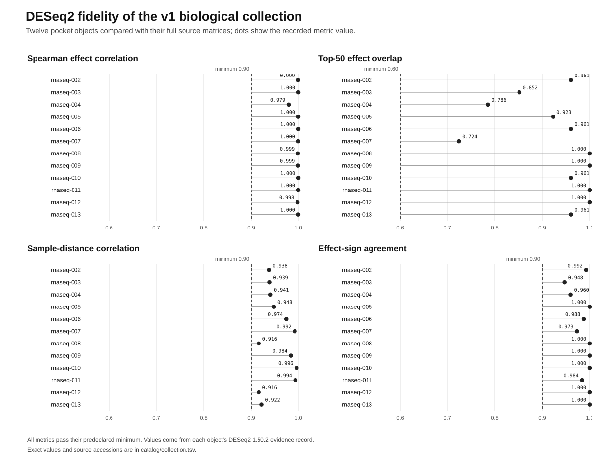

# OpenOmicsBench

OpenOmicsBench provides compact bulk RNA-seq count matrices for testing analysis software, teaching reproducible workflows and checking method behavior. Each biological object includes the source counts for its selected samples, a smaller pocket matrix, the sample design, source attribution, rights evidence, reference details and quantitative validation.

The version 1 collection contains 12 benchmark objects drawn from seven Expression Atlas studies. It covers human, mouse and Arabidopsis data, with balanced knockouts, paired tumour samples, factorial infection experiments, RNA interference and disease comparisons. The objects are tests of software and methods. They are not clinical reference data and do not replace the full source studies.

The published [0.1.0.dev0 prerelease](https://doi.org/10.5281/zenodo.22551735) records the earlier infrastructure baseline. Version 1.0.0 is in final review.

## Quickstart

Use Python 3.11 or newer in an isolated environment. From the repository root:

```sh
python -m pip install -r requirements-tested.txt
python -m pip install --no-deps -e .
omicsbench list --assay bulk_rna_seq
omicsbench info rnaseq-002
omicsbench validate rnaseq-002
```

`omicsbench validate` checks the manifest, file inventory, byte counts, SHA-256 hashes, sample order, matrix shape and unchanged integer counts. It then recomputes the four declared preservation metrics. The command works without a network connection because each v1 object is self-contained.

Use `omicsbench get rnaseq-002 --size pocket` to copy a verified tier into the local cache. Use `omicsbench provenance rnaseq-002` to inspect its source and transformation record. Every public command includes an example in its help text.

## Version 1 collection

| ID | Design | Samples | Pocket genes |
|---|---|---:|---:|
| `rnaseq-002` | SLC2A5 knockout in A549 xenografts | 10 | 2,000 |
| `rnaseq-003` | AtRsgA knockout in Arabidopsis seedlings | 6 | 4,000 |
| `rnaseq-004` | Klf1 knockout in mouse erythroid tissue | 6 | 4,000 |
| `rnaseq-005` | Paired prostate tumour and adjacent tissue | 28 | 8,000 |
| `rnaseq-006` | Arabidopsis infection adjusted for genotype | 12 | 500 |
| `rnaseq-007` | ELP3 depletion in BT549 cells | 6 | 8,000 |
| `rnaseq-008` | Duchenne muscular dystrophy myoblasts | 9 | 8,000 |
| `rnaseq-009` | Arabidopsis genotype adjusted for infection | 12 | 500 |
| `rnaseq-010` | Infection response in wild-type Arabidopsis | 6 | 500 |
| `rnaseq-011` | Infection response in gsnor1 Arabidopsis | 6 | 500 |
| `rnaseq-012` | Dmd-mdx myoblasts against wild type | 6 | 8,000 |
| `rnaseq-013` | Dmd-mdx-beta-geo myoblasts against wild type | 6 | 8,000 |

The [catalog](catalog/collection.json) contains the complete object index. The tabular form is in [catalog/collection.tsv](catalog/collection.tsv).



All 12 pockets pass the predeclared thresholds when compared with the corresponding full source matrix using DESeq2 1.50.2. The evidence files retain exact values, input hashes, workflow hashes, model designs and runtime versions. A separate reference check confirms that every pocket gene identifier occurs in the matching Ensembl or Ensembl Genomes annotation release.

Some objects share samples because they test different declared contrasts or strata from the same factorial study. The [collection audit](release/collection-audit.json) records those relationships and checks for conflicting IDs, cross-study sample collisions, unclassified duplicate files and repeated long prose.

## Source data and licences

Expression Atlas and BioStudies supplied the biological source matrices. Each object includes `attribution.json` and `rights.json`. The distributed biological material is recorded as CC BY 4.0 with provider credit and a dated evidence link. Exact source, reference and transformation records sit beside the data rather than in a separate spreadsheet.

The software is licensed under Apache License 2.0. Project-written documentation and descriptive metadata are licensed under Creative Commons Attribution 4.0 International. Third-party material keeps the terms stated in its object record.

## Project checks

Run the same checks used by continuous integration:

```sh
python -m unittest discover -s tests -v
python scripts/build_catalog.py
python scripts/audit_collection.py
python scripts/check_repository.py
python scripts/certify_release.py --preflight
```

The local v1 preflight passes with no scientific or structural blockers. Publication still requires an independent person to complete the quickstart, the exact Zenodo version DOI to be inserted after reservation, and the uploaded archive to be downloaded and checked against the release inventory.

The [version 1 release review](docs/OpenOmicsBench_V1_Release_Review.pdf) brings the collection, scientific checks, overlap findings, software tests and remaining publication steps into one six-page document.

## Citation

Zenodo should display the author as Vivaan Patni. GitHub development and commits use the account `vxxqv`. Cite the archived version used in an analysis; the concept DOI for all releases is [10.5281/zenodo.22551734](https://doi.org/10.5281/zenodo.22551734).
